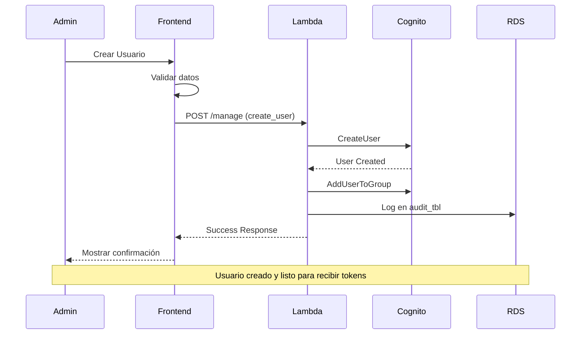
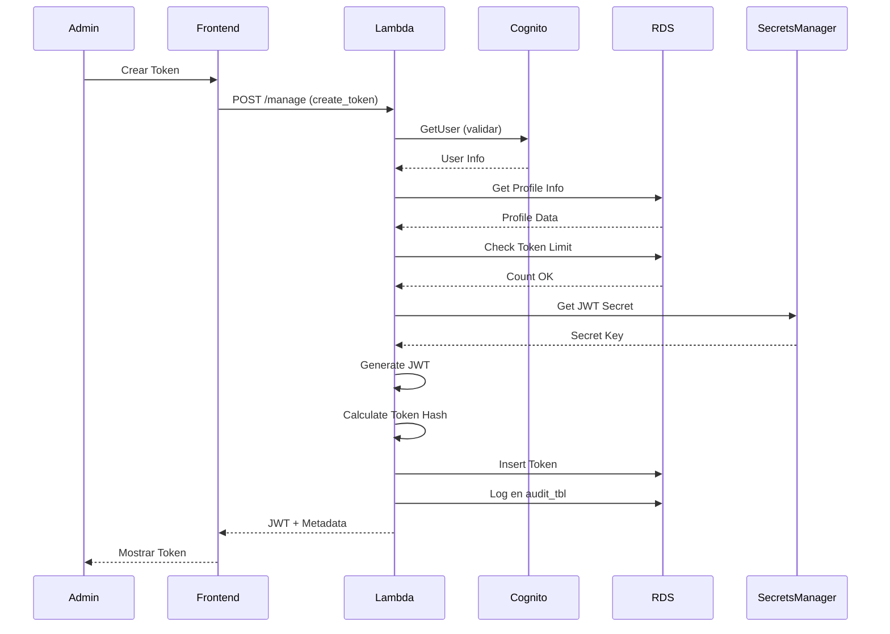
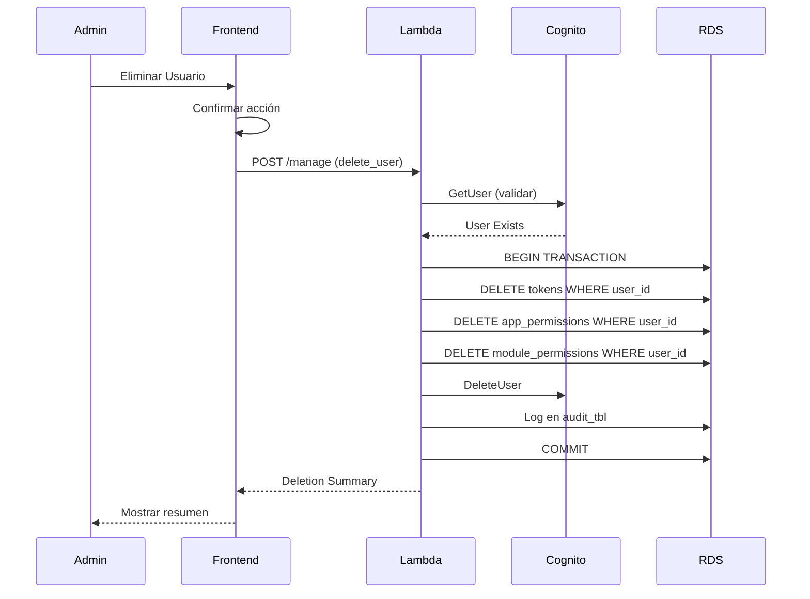

# Identity Manager - Especificaciones de Diseño

## 📋 Índice

1. [Visión General](#visión-general)
2. [Arquitectura](#arquitectura)
3. [Modelo de Datos](#modelo-de-datos)
4. [Funcionalidades](#funcionalidades)
5. [API Backend](#api-backend)
6. [Frontend](#frontend)
7. [Seguridad](#seguridad)
8. [Flujos de Trabajo](#flujos-de-trabajo)

---

## 🎯 Visión General

### Propósito
Aplicación web para la gestión centralizada de usuarios de AWS Cognito, perfiles de inferencia de Bedrock y tokens JWT para acceso a servicios de IA.

### Alcance
- Gestión completa de usuarios de Cognito
- Administración de tokens JWT con perfiles de inferencia
- Control de permisos a nivel de aplicación y módulo
- Revocación y eliminación de tokens

### Stack Tecnológico
- **Frontend**: HTML5 + JavaScript (Vanilla JS o framework ligero)
- **Backend**: AWS Lambda (Python 3.12)
- **Base de Datos**: PostgreSQL RDS (con esquema UUID)
- **Autenticación**: AWS Cognito
- **Infraestructura**: AWS (Lambda, API Gateway, RDS, Secrets Manager)

---

## 🏗️ Arquitectura

### Diagrama de Componentes

```
┌─────────────────────────────────────────────────────────────┐
│                      FRONTEND (HTML/JS)                      │
│  ┌──────────────┐  ┌──────────────┐  ┌──────────────┐      │
│  │   Usuarios   │  │    Tokens    │  │   Permisos   │      │
│  └──────────────┘  └──────────────┘  └──────────────┘      │
└─────────────────────────────────────────────────────────────┘
                              │
                              │ HTTPS/REST
                              ▼
┌─────────────────────────────────────────────────────────────┐
│                      API GATEWAY                             │
└─────────────────────────────────────────────────────────────┘
                              │
                              ▼
┌─────────────────────────────────────────────────────────────┐
│              LAMBDA FUNCTION (identity-mgmt-dev-api-lmbd)    │
│  ┌──────────────────────────────────────────────────────┐   │
│  │  Handler Principal                                    │   │
│  │  - Routing de operaciones                            │   │
│  │  - Validación de requests                            │   │
│  │  - Gestión de errores                                │   │
│  └──────────────────────────────────────────────────────┘   │
│                                                               │
│  ┌──────────────┐  ┌──────────────┐  ┌──────────────┐      │
│  │   Cognito    │  │   Database   │  │     JWT      │      │
│  │   Service    │  │   Service    │  │   Service    │      │
│  └──────────────┘  └──────────────┘  └──────────────┘      │
└─────────────────────────────────────────────────────────────┘
           │                    │                    │
           ▼                    ▼                    ▼
    ┌──────────┐        ┌──────────┐        ┌──────────┐
    │ Cognito  │        │   RDS    │        │  Secrets │
    │   Pool   │        │PostgreSQL│        │ Manager  │
    └──────────┘        └──────────┘        └──────────┘
```

### Componentes Principales

#### 1. Frontend (SPA - Single Page Application)
- **Tecnología**: HTML5, CSS3, JavaScript ES6+
- **Responsabilidades**:
  - Interfaz de usuario responsive
  - Validación de formularios
  - Comunicación con API REST
  - Gestión de estado de la aplicación
  - Renderizado dinámico de datos

#### 2. Backend (AWS Lambda)
- **Nombre**: `identity-mgmt-dev-api-lmbd`
- **Nomenclatura**: `<aplicacion>-<entorno>-<funcion>-lmbd`
  - Aplicación: `identity-mgmt`
  - Entorno: `dev` (dev/pre/pro)
  - Función: `api` (propósito específico)
- **Runtime**: Python 3.12
- **Responsabilidades**:
  - Endpoint único para todas las operaciones
  - Routing interno basado en `operation` parameter
  - Integración con AWS Cognito
  - Gestión de base de datos PostgreSQL
  - Generación y validación de tokens JWT
  - Logging y auditoría

#### 3. Base de Datos (PostgreSQL RDS)
- **Esquema**: identity_manager_dev_rds
- **Características**:
  - UUIDs como primary keys
  - Relaciones con foreign keys
  - Índices optimizados
  - Triggers para auditoría

---

## 📊 Modelo de Datos

### Tablas Principales Utilizadas

#### 1. identity-manager-config-tbl
```sql
- cognito_user_pool_id: eu-west-1_UaMIbG9pD
- token_expiry_hours: 2160 (90 días)
- max_tokens_per_user: 2
- default_model: eu.anthropic.claude-sonnet-4-5-v2:0
```

#### 2. identity-manager-profiles-tbl
```sql
- id: UUID
- profile_name: VARCHAR(100)
- cognito_group_name: VARCHAR(100)
- application_id: UUID (FK)
- model_id: UUID (FK)
- model_arn: TEXT
- is_active: BOOLEAN
```

#### 3. identity-manager-tokens-tbl
```sql
- id: UUID
- cognito_user_id: VARCHAR(255)
- cognito_email: VARCHAR(255)
- jti: VARCHAR(255) UNIQUE
- token_hash: TEXT UNIQUE
- application_profile_id: UUID (FK)
- issued_at: TIMESTAMP
- expires_at: TIMESTAMP
- is_revoked: BOOLEAN
- revoked_at: TIMESTAMP
- revocation_reason: TEXT
```

#### 4. identity-manager-app-permissions-tbl
```sql
- id: UUID
- cognito_user_id: VARCHAR(255)
- cognito_email: VARCHAR(255)
- application_id: UUID (FK)
- permission_type_id: UUID (FK)
- is_active: BOOLEAN
```

#### 5. identity-manager-module-permissions-tbl
```sql
- id: UUID
- cognito_user_id: VARCHAR(255)
- cognito_email: VARCHAR(255)
- application_module_id: UUID (FK)
- permission_type_id: UUID (FK)
- is_active: BOOLEAN
```

---

## ⚙️ Funcionalidades

### 1. Gestión de Usuarios de Cognito

#### 1.1 Consulta de Usuarios
**Descripción**: Listar todos los usuarios del User Pool de Cognito

**Entrada**:
```json
{
  "operation": "list_users",
  "filters": {
    "group": "optional_group_name",
    "status": "CONFIRMED|UNCONFIRMED|ARCHIVED|COMPROMISED|UNKNOWN|RESET_REQUIRED|FORCE_CHANGE_PASSWORD"
  },
  "pagination": {
    "limit": 60,
    "pagination_token": "optional_token"
  }
}
```

**Salida**:
```json
{
  "users": [
    {
      "user_id": "uuid",
      "email": "user@example.com",
      "person": "Juan Pérez García",
      "status": "CONFIRMED",
      "groups": ["developers-group", "admin-group"],
      "created_date": "2026-02-28T10:00:00Z",
      "enabled": true
    }
  ],
  "pagination_token": "next_token",
  "total_count": 150
}
```

#### 1.2 Creación de Usuario
**Descripción**: Crear un nuevo usuario en Cognito y asignarlo a un grupo

**Entrada**:
```json
{
  "operation": "create_user",
  "data": {
    "email": "newuser@example.com",
    "person": "María López Fernández",
    "group": "developers-group",
    "temporary_password": "TempPass123!",
    "send_email": true
  }
}
```

**Validaciones**:
- Email válido y único
- Nombre y apellidos no vacíos
- Grupo debe existir en el User Pool
- Password cumple política de Cognito

**Salida**:
```json
{
  "success": true,
  "user": {
    "user_id": "uuid",
    "email": "newuser@example.com",
    "person": "María López Fernández",
    "status": "FORCE_CHANGE_PASSWORD",
    "groups": ["developers-group"]
  },
  "message": "Usuario creado correctamente. Email de bienvenida enviado."
}
```

#### 1.3 Borrado de Usuario
**Descripción**: Eliminar usuario de Cognito y limpiar todos sus datos relacionados en BD

**Entrada**:
```json
{
  "operation": "delete_user",
  "user_id": "cognito_user_id"
}
```

**Proceso**:
1. Verificar que el usuario existe en Cognito
2. Eliminar usuario de Cognito
3. Eliminar tokens JWT del usuario en BD
4. Eliminar permisos de aplicación del usuario
5. Eliminar permisos de módulos del usuario
6. Registrar operación en auditoría

**Salida**:
```json
{
  "success": true,
  "deleted": {
    "cognito_user": true,
    "tokens_deleted": 2,
    "app_permissions_deleted": 3,
    "module_permissions_deleted": 5
  },
  "message": "Usuario y todos sus datos eliminados correctamente"
}
```

### 2. Gestión de Tokens JWT

#### 2.1 Creación de Token JWT
**Descripción**: Generar un nuevo token JWT para un usuario con un perfil de inferencia

**Entrada**:
```json
{
  "operation": "create_token",
  "data": {
    "user_id": "cognito_user_id",
    "validity_period": "90_days",
    "application_profile_id": "uuid_of_profile"
  }
}
```

**Opciones de Validez**:
- `1_day`: 24 horas
- `7_days`: 168 horas
- `30_days`: 720 horas
- `60_days`: 1440 horas
- `90_days`: 2160 horas (por defecto)

**Proceso**:
1. Validar que el usuario existe en Cognito
2. Obtener información del usuario (email, person, groups)
3. Validar que el perfil de inferencia existe y está activo
4. Verificar límite de tokens activos por usuario (max: 2)
5. Generar JWT con claims especificados
6. Calcular hash del token
7. Guardar en BD con estado activo

**Estructura del Token JWT**:
```json
{
  "user_id": "uuid-cognito-user",
  "email": "user@example.com",
  "default_inference_profile": "profile-uuid",
  "team": "developers-group",
  "person": "Juan Pérez García",
  "iss": "identity-manager",
  "sub": "uuid-cognito-user",
  "aud": ["bedrock-proxy", "kb-agent"],
  "exp": 1771930682,
  "iat": 1769170682,
  "jti": "unique-jwt-id-uuid"
}
```

**Salida**:
```json
{
  "success": true,
  "token": {
    "jwt": "eyJhbGciOiJIUzI1NiIsInR5cCI6IkpXVCJ9...",
    "token_id": "uuid",
    "jti": "unique-jwt-id",
    "issued_at": "2026-02-28T10:00:00Z",
    "expires_at": "2026-05-29T10:00:00Z",
    "validity_days": 90,
    "profile": {
      "profile_name": "Developers - Claude Sonnet 4.5",
      "model": "eu.anthropic.claude-sonnet-4-5-v2:0",
      "application": "kb-agent"
    }
  },
  "message": "Token JWT creado correctamente"
}
```

#### 2.2 Listado de Tokens
**Descripción**: Consultar tokens de un usuario o todos los tokens

**Entrada**:
```json
{
  "operation": "list_tokens",
  "filters": {
    "user_id": "optional_cognito_user_id",
    "status": "active|revoked|expired|all",
    "profile_id": "optional_profile_uuid"
  },
  "pagination": {
    "limit": 50,
    "offset": 0
  }
}
```

**Salida**:
```json
{
  "tokens": [
    {
      "token_id": "uuid",
      "jti": "jwt-id",
      "user_email": "user@example.com",
      "user_person": "Juan Pérez",
      "profile_name": "Developers - Claude Sonnet 4.5",
      "issued_at": "2026-02-28T10:00:00Z",
      "expires_at": "2026-05-29T10:00:00Z",
      "last_used_at": "2026-02-28T12:30:00Z",
      "is_revoked": false,
      "is_expired": false,
      "status": "active"
    }
  ],
  "total_count": 25
}
```

#### 2.3 Revocación de Token
**Descripción**: Revocar un token JWT sin eliminarlo de la BD

**Entrada**:
```json
{
  "operation": "revoke_token",
  "token_id": "uuid",
  "reason": "Usuario cambió de rol"
}
```

**Proceso**:
1. Verificar que el token existe
2. Actualizar `is_revoked = true`
3. Establecer `revoked_at = CURRENT_TIMESTAMP`
4. Guardar `revocation_reason`
5. Registrar en auditoría

**Salida**:
```json
{
  "success": true,
  "token": {
    "token_id": "uuid",
    "jti": "jwt-id",
    "revoked_at": "2026-02-28T13:00:00Z",
    "reason": "Usuario cambió de rol"
  },
  "message": "Token revocado correctamente"
}
```

#### 2.4 Eliminación Definitiva de Token
**Descripción**: Borrar permanentemente un token de la BD

**Entrada**:
```json
{
  "operation": "delete_token",
  "token_id": "uuid"
}
```

**Proceso**:
1. Verificar que el token existe
2. Eliminar registro de la tabla `identity-manager-tokens-tbl`
3. Registrar operación en auditoría

**Salida**:
```json
{
  "success": true,
  "message": "Token eliminado permanentemente de la base de datos"
}
```

### 3. Gestión de Perfiles de Inferencia

#### 3.1 Listado de Perfiles
**Descripción**: Obtener todos los perfiles de inferencia disponibles

**Entrada**:
```json
{
  "operation": "list_profiles",
  "filters": {
    "application_id": "optional_uuid",
    "is_active": true
  }
}
```

**Salida**:
```json
{
  "profiles": [
    {
      "profile_id": "uuid",
      "profile_name": "Developers - Claude Sonnet 4.5",
      "cognito_group": "developers-group",
      "application": "kb-agent",
      "model_name": "Claude Sonnet 4.5 v2 (EU)",
      "model_id": "eu.anthropic.claude-sonnet-4-5-v2:0",
      "model_arn": "arn:aws:bedrock:eu-west-1::foundation-model/...",
      "is_active": true
    }
  ]
}
```

### 4. Gestión de Grupos de Cognito

#### 4.1 Listado de Grupos
**Descripción**: Obtener todos los grupos del User Pool

**Entrada**:
```json
{
  "operation": "list_groups"
}
```

**Salida**:
```json
{
  "groups": [
    {
      "group_name": "developers-group",
      "description": "Grupo de desarrolladores",
      "precedence": 1,
      "user_count": 15
    },
    {
      "group_name": "admin-group",
      "description": "Administradores del sistema",
      "precedence": 0,
      "user_count": 3
    }
  ]
}
```

---

## 🔌 API Backend

### Endpoint Único

**URL**: `https://api.identity-manager.com/v1/manage`
**Método**: POST
**Content-Type**: application/json

### Estructura de Request

```json
{
  "operation": "operation_name",
  "data": {
    // Parámetros específicos de la operación
  },
  "filters": {
    // Filtros opcionales
  },
  "pagination": {
    // Paginación opcional
  }
}
```

### Estructura de Response

#### Success Response
```json
{
  "success": true,
  "data": {
    // Datos de respuesta
  },
  "message": "Operación completada correctamente",
  "timestamp": "2026-02-28T13:00:00Z"
}
```

#### Error Response
```json
{
  "success": false,
  "error": {
    "code": "ERROR_CODE",
    "message": "Descripción del error",
    "details": {
      // Detalles adicionales del error
    }
  },
  "timestamp": "2026-02-28T13:00:00Z"
}
```

### Códigos de Error

| Código | Descripción |
|--------|-------------|
| `INVALID_OPERATION` | Operación no reconocida |
| `MISSING_PARAMETERS` | Faltan parámetros requeridos |
| `USER_NOT_FOUND` | Usuario no existe en Cognito |
| `TOKEN_LIMIT_EXCEEDED` | Usuario alcanzó límite de tokens |
| `PROFILE_NOT_FOUND` | Perfil de inferencia no existe |
| `PROFILE_INACTIVE` | Perfil de inferencia inactivo |
| `DATABASE_ERROR` | Error en operación de BD |
| `COGNITO_ERROR` | Error en operación de Cognito |
| `UNAUTHORIZED` | No autorizado para esta operación |
| `VALIDATION_ERROR` | Error de validación de datos |

### Operaciones Disponibles

| Operación | Descripción |
|-----------|-------------|
| `list_users` | Listar usuarios de Cognito |
| `create_user` | Crear nuevo usuario |
| `delete_user` | Eliminar usuario y sus datos |
| `list_tokens` | Listar tokens JWT |
| `create_token` | Crear nuevo token JWT |
| `revoke_token` | Revocar token JWT |
| `delete_token` | Eliminar token permanentemente |
| `list_profiles` | Listar perfiles de inferencia |
| `list_groups` | Listar grupos de Cognito |
| `get_config` | Obtener configuración del sistema |

---

## 🎨 Frontend

### Estructura de la Aplicación

```
frontend/
├── index.html
├── css/
│   ├── main.css
│   ├── components.css
│   └── responsive.css
├── js/
│   ├── app.js              # Inicialización
│   ├── api.js              # Cliente API
│   ├── components/
│   │   ├── users.js        # Gestión de usuarios
│   │   ├── tokens.js       # Gestión de tokens
│   │   └── profiles.js     # Gestión de perfiles
│   ├── utils/
│   │   ├── validation.js   # Validaciones
│   │   ├── formatting.js   # Formateo de datos
│   │   └── notifications.js # Notificaciones
│   └── config.js           # Configuración
└── assets/
    ├── images/
    └── icons/
```

### Pantallas Principales

#### 1. Dashboard
- Resumen de usuarios activos
- Tokens activos vs revocados
- Últimas operaciones
- Estadísticas generales

#### 2. Gestión de Usuarios
**Componentes**:
- Tabla de usuarios con filtros
- Botón "Crear Usuario"
- Acciones por usuario: Ver detalles, Eliminar
- Búsqueda por email/nombre

**Formulario de Creación**:
```html
<form id="create-user-form">
  <input type="email" name="email" required placeholder="Email">
  <input type="text" name="person" required placeholder="Nombre y Apellidos">
  <select name="group" required>
    <option value="">Seleccionar grupo...</option>
    <!-- Grupos dinámicos desde API -->
  </select>
  <input type="password" name="temporary_password" placeholder="Contraseña temporal (opcional)">
  <label>
    <input type="checkbox" name="send_email" checked>
    Enviar email de bienvenida
  </label>
  <button type="submit">Crear Usuario</button>
</form>
```

#### 3. Gestión de Tokens
**Componentes**:
- Tabla de tokens con filtros (activos, revocados, expirados)
- Botón "Crear Token"
- Acciones por token: Ver detalles, Revocar, Eliminar
- Filtro por usuario
- Indicador visual de estado

**Formulario de Creación de Token**:
```html
<form id="create-token-form">
  <select name="user_id" required>
    <option value="">Seleccionar usuario...</option>
    <!-- Usuarios dinámicos desde API -->
  </select>
  
  <select name="validity_period" required>
    <option value="1_day">1 día</option>
    <option value="7_days">7 días</option>
    <option value="30_days">30 días</option>
    <option value="60_days">60 días</option>
    <option value="90_days" selected>90 días (por defecto)</option>
  </select>
  
  <select name="application_profile_id" required>
    <option value="">Seleccionar perfil de inferencia...</option>
    <!-- Perfiles dinámicos desde API -->
  </select>
  
  <button type="submit">Crear Token JWT</button>
</form>
```

**Vista de Token Creado**:
```html
<div class="token-display">
  <h3>Token JWT Creado</h3>
  <div class="token-value">
    <code id="jwt-token">eyJhbGciOiJIUzI1NiIsInR5cCI6IkpXVCJ9...</code>
    <button onclick="copyToken()">Copiar</button>
  </div>
  <div class="token-info">
    <p><strong>JTI:</strong> <span id="jti">uuid</span></p>
    <p><strong>Válido hasta:</strong> <span id="expires">2026-05-29 10:00:00</span></p>
    <p><strong>Perfil:</strong> <span id="profile">Developers - Claude Sonnet 4.5</span></p>
  </div>
</div>
```

#### 4. Perfiles de Inferencia
**Componentes**:
- Lista de perfiles disponibles
- Información de modelo asociado
- Estado (activo/inactivo)
- Grupo de Cognito asociado

### Interacciones del Usuario

#### Flujo: Crear Usuario
1. Usuario hace clic en "Crear Usuario"
2. Se muestra modal con formulario
3. Usuario completa datos (email, nombre, grupo)
4. Sistema valida datos en cliente
5. Se envía request a API
6. API crea usuario en Cognito
7. Se muestra confirmación
8. Tabla de usuarios se actualiza

#### Flujo: Crear Token JWT
1. Usuario hace clic en "Crear Token"
2. Se muestra modal con formulario
3. Usuario selecciona:
   - Usuario de Cognito
   - Período de validez
   - Perfil de inferencia
4. Sistema valida selecciones
5. Se envía request a API
6. API genera JWT y guarda en BD
7. Se muestra token generado con opción de copiar
8. Tabla de tokens se actualiza

#### Flujo: Revocar Token
1. Usuario hace clic en "Revocar" en un token
2. Se muestra diálogo de confirmación con campo de razón
3. Usuario confirma y proporciona razón
4. Se envía request a API
5. API marca token como revocado
6. Se muestra confirmación
7. Estado del token se actualiza en tabla

#### Flujo: Eliminar Usuario
1. Usuario hace clic en "Eliminar" en un usuario
2. Se muestra diálogo de confirmación con advertencia
3. Sistema muestra datos que serán eliminados:
   - Tokens activos del usuario
   - Permisos de aplicación
   - Permisos de módulos
4. Usuario confirma eliminación
5. Se envía request a API
6. API elimina usuario de Cognito y limpia BD
7. Se muestra resumen de eliminación
8. Usuario desaparece de la tabla

### Componentes Reutilizables

#### DataTable Component
```javascript
class DataTable {
  constructor(containerId, columns, options) {
    this.container = document.getElementById(containerId);
    this.columns = columns;
    this.options = options;
    this.data = [];
  }
  
  render(data) {
    // Renderizar tabla con datos
  }
  
  addFilters(filters) {
    // Añadir filtros a la tabla
  }
  
  addActions(actions) {
    // Añadir acciones por fila
  }
}
```

#### Modal Component
```javascript
class Modal {
  constructor(title, content, options) {
    this.title = title;
    this.content = content;
    this.options = options;
  }
  
  show() {
    // Mostrar modal
  }
  
  hide() {
    // Ocultar modal
  }
  
  onSubmit(callback) {
    // Manejar submit
  }
}
```

#### Notification Component
```javascript
class Notification {
  static success(message) {
    // Mostrar notificación de éxito
  }
  
  static error(message) {
    // Mostrar notificación de error
  }
  
  static warning(message) {
    // Mostrar notificación de advertencia
  }
  
  static info(message) {
    // Mostrar notificación informativa
  }
}
```

---

## 🔒 Seguridad

### Autenticación y Autorización

#### Frontend
- Autenticación mediante AWS Cognito
- Token de sesión almacenado en sessionStorage
- Validación de sesión en cada request
- Logout automático al expirar sesión

#### Backend (Lambda)
- Validación de token de Cognito en cada request
- Verificación de permisos según rol del usuario
- Rate limiting por IP
- Logging de todas las operaciones

### Validaciones

#### Lado Cliente
- Email válido (formato RFC 5322)
- Nombre y apellidos no vacíos
- Selección de grupo obligatoria
- Período de validez dentro de opciones permitidas
- Perfil de inferencia activo

#### Lado Servidor
- Validación de todos los parámetros
- Verificación de existencia de recursos
- Validación de límites (max tokens por usuario)
- Sanitización de inputs
- Validación de tipos de datos

### Protección de Datos

#### Tokens JWT
- Almacenamiento de hash en BD (no el token completo)
- Tokens firmados con clave secreta (AWS Secrets Manager)
- Validación de firma en cada uso
- Revocación inmediata disponible

#### Credenciales
- Passwords de Cognito con política fuerte
- Secrets Manager para credenciales de BD
- No exposición de secrets en logs
- Rotación periódica de secrets

#### Auditoría
- Registro de todas las operaciones en `identity-manager-audit-tbl`
- Información registrada:
  - Usuario que realiza la operación
  - Usuario afectado
  - Tipo de operación
  - Timestamp
  - IP de origen
  - Valores anteriores y nuevos (para updates)

---

## 🔄 Flujos de Trabajo

### Flujo Completo: Onboarding de Usuario



### Flujo Completo: Generación de Token JWT



### Flujo Completo: Eliminación de Usuario



---

## 📝 Consideraciones de Implementación

### Fase 1: Backend (Lambda)
1. Configurar Lambda `identity-mgmt-dev-api-lmbd` con Python 3.12
2. Implementar handler principal con routing
3. Crear servicios para Cognito, RDS y JWT
4. Implementar operaciones CRUD
5. Añadir validaciones y manejo de errores
6. Configurar API Gateway
7. Testing unitario y de integración

### Fase 2: Base de Datos
1. Verificar esquema UUID está desplegado
2. Crear índices adicionales si es necesario
3. Configurar conexión desde Lambda
4. Testing de queries

### Fase 3: Frontend
1. Estructura HTML base
2. Estilos CSS responsive
3. Componentes JavaScript reutilizables
4. Integración con API
5. Validaciones cliente
6. Testing en diferentes navegadores

### Fase 4: Integración y Testing
1. Testing end-to-end
2. Testing de seguridad
3. Testing de performance
4. Ajustes y optimizaciones

### Fase 5: Despliegue
1. Configurar CI/CD
2. Desplegar en entorno dev
3. Testing en dev
4. Desplegar en producción
5. Monitoreo y logging

---

## 📊 Métricas y Monitoreo

### Métricas Clave
- Número de usuarios activos
- Tokens activos vs revocados
- Operaciones por minuto
- Tiempo de respuesta de API
- Errores por tipo
- Uso de perfiles de inferencia

### Logging
- CloudWatch Logs para Lambda
- Logs estructurados en JSON
- Niveles: DEBUG, INFO, WARNING, ERROR, CRITICAL
- Correlación de requests con request_id

### Alertas
- Tasa de errores > 5%
- Latencia > 2 segundos
- Límite de tokens alcanzado frecuentemente
- Fallos de conexión a RDS
- Fallos de conexión a Cognito

---

## 🚀 Roadmap Futuro

### Mejoras Planificadas
1. **Gestión de Permisos Granular**
   - UI para asignar permisos a nivel de aplicación
   - UI para asignar permisos a nivel de módulo
   - Roles predefinidos

2. **Dashboard Avanzado**
   - Gráficos de uso de tokens
   - Análisis de patrones de uso
   - Reportes exportables

3. **Notificaciones**
   - Email cuando token está por expirar
   - Notificaciones de actividad sospechosa
   - Alertas de límites alcanzados

4. **Auditoría Avanzada**
   - Visualización de logs de auditoría
   - Búsqueda y filtrado avanzado
   - Exportación de auditoría

5. **Multi-tenancy**
   - Soporte para múltiples User Pools
   - Aislamiento de datos por tenant
   - Configuración por tenant

---

## 📚 Referencias

### AWS Services
- [AWS Cognito Documentation](https://docs.aws.amazon.com/cognito/)
- [AWS Lambda Documentation](https://docs.aws.amazon.com/lambda/)
- [AWS RDS PostgreSQL](https://docs.aws.amazon.com/AmazonRDS/latest/UserGuide/CHAP_PostgreSQL.html)
- [AWS Secrets Manager](https://docs.aws.amazon.com/secretsmanager/)

### Standards
- [JWT RFC 7519](https://tools.ietf.org/html/rfc7519)
- [OAuth 2.0 RFC 6749](https://tools.ietf.org/html/rfc6749)
- [REST API Best Practices](https://restfulapi.net/)

---

## 📄 Licencia y Contacto

**Proyecto**: Identity Manager v5.0 (UUID Edition)
**Fecha**: 2026-02-28
**Autor**: TCS Team
**Entorno**: AWS eu-west-1

---

*Este documento es una especificación viva y será actualizado conforme evolucione el proyecto.*
