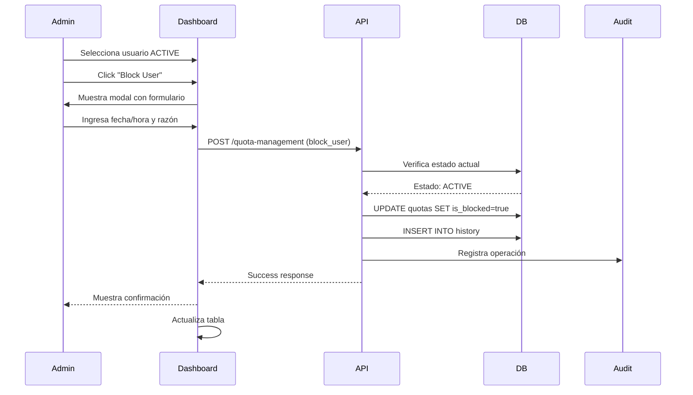
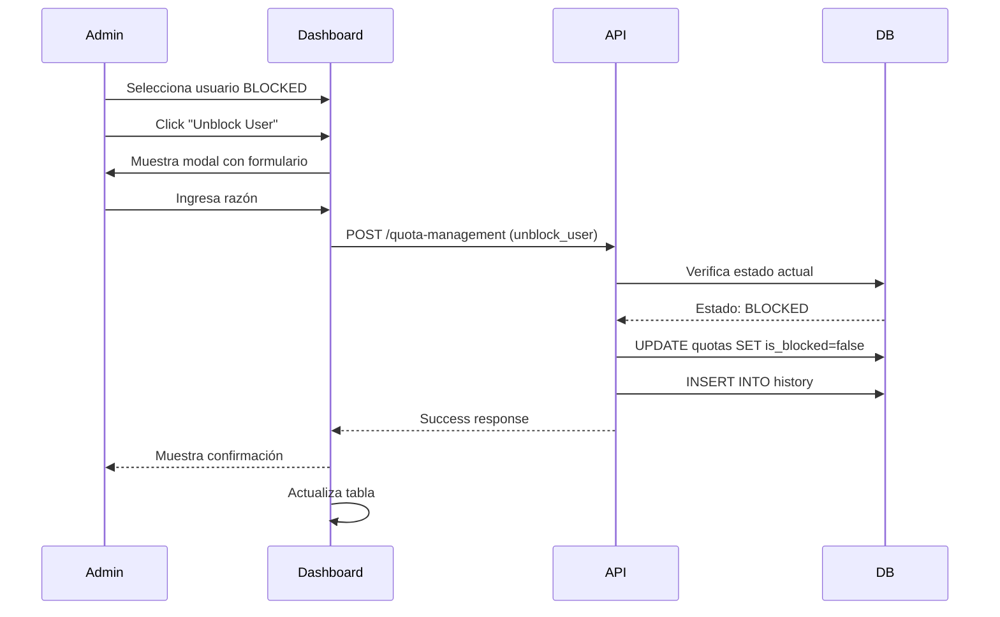
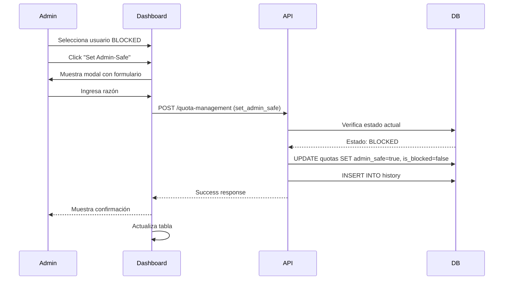

# Gestión de Bloqueos y Cuotas de Usuarios

## 📋 Índice

1. [Visión General](#visión-general)
2. [Modelo de Datos](#modelo-de-datos)
3. [Estados de Usuario](#estados-de-usuario)
4. [Operaciones](#operaciones)
5. [Reglas de Negocio](#reglas-de-negocio)
6. [API Endpoints](#api-endpoints)
7. [Flujos de Trabajo](#flujos-de-trabajo)
8. [Interfaz de Usuario](#interfaz-de-usuario)
9. [Auditoría](#auditoría)

---

## Visión General

Sistema de gestión manual de bloqueos y desbloqueos de usuarios para el control de acceso al proxy Bedrock. Permite a los administradores:

- **Bloquear usuarios** temporalmente con fecha/hora de fin
- **Desbloquear usuarios** bloqueados o en estado admin-safe
- **Marcar usuarios como Admin-Safe** para protegerlos de bloqueos automáticos

---

## Modelo de Datos

### Tabla: `bedrock-proxy-user-quotas-tbl`

Campos relevantes para la gestión de bloqueos:

```sql
CREATE TABLE "bedrock-proxy-user-quotas-tbl" (
    id UUID PRIMARY KEY,
    cognito_user_id VARCHAR(255) NOT NULL UNIQUE,
    cognito_email VARCHAR(255) NOT NULL,
    
    -- Cuotas
    daily_request_limit INTEGER,
    quota_date DATE NOT NULL DEFAULT CURRENT_DATE,
    requests_today INTEGER NOT NULL DEFAULT 0,
    
    -- Bloqueo
    is_blocked BOOLEAN NOT NULL DEFAULT false,
    blocked_at TIMESTAMP,
    blocked_until TIMESTAMP,
    blocked_by VARCHAR(255),              -- NUEVO: Quién bloqueó
    block_reason TEXT,                    -- NUEVO: Razón del bloqueo
    
    -- Admin Safe
    administrative_safe BOOLEAN NOT NULL DEFAULT false,
    administrative_safe_set_by VARCHAR(255),
    administrative_safe_set_at TIMESTAMP,
    administrative_safe_reason TEXT,
    
    -- Desbloqueo
    unblocked_at TIMESTAMP,               -- NUEVO: Cuándo se desbloqueó
    unblocked_by VARCHAR(255),            -- NUEVO: Quién desbloqueó
    unblock_reason TEXT,                  -- NUEVO: Razón del desbloqueo
    
    -- Metadata
    team VARCHAR(100),
    person VARCHAR(255),
    created_at TIMESTAMP NOT NULL DEFAULT CURRENT_TIMESTAMP,
    updated_at TIMESTAMP NOT NULL DEFAULT CURRENT_TIMESTAMP,
    last_request_at TIMESTAMP
);
```

### Tabla: `bedrock-proxy-quota-blocks-history-tbl`

Historial de todas las operaciones de bloqueo/desbloqueo:

```sql
CREATE TABLE "bedrock-proxy-quota-blocks-history-tbl" (
    id UUID PRIMARY KEY,
    cognito_user_id VARCHAR(255) NOT NULL,
    cognito_email VARCHAR(255) NOT NULL,
    
    -- Operación
    operation_type VARCHAR(20) NOT NULL,  -- 'BLOCK', 'UNBLOCK', 'SET_ADMIN_SAFE', 'REMOVE_ADMIN_SAFE'
    operation_timestamp TIMESTAMP NOT NULL DEFAULT CURRENT_TIMESTAMP,
    performed_by VARCHAR(255) NOT NULL,   -- Email del admin que realizó la operación
    
    -- Detalles del bloqueo
    block_date DATE NOT NULL,
    blocked_at TIMESTAMP,
    blocked_until TIMESTAMP,
    block_reason TEXT,
    
    -- Detalles del desbloqueo
    unblocked_at TIMESTAMP,
    unblock_reason TEXT,
    
    -- Estado anterior y nuevo
    previous_state VARCHAR(20),           -- 'ACTIVE', 'BLOCKED', 'ADMIN_SAFE'
    new_state VARCHAR(20),                -- 'ACTIVE', 'BLOCKED', 'ADMIN_SAFE'
    
    -- Contexto
    requests_count INTEGER,
    daily_limit INTEGER,
    team VARCHAR(100),
    person VARCHAR(255),
    
    created_at TIMESTAMP NOT NULL DEFAULT CURRENT_TIMESTAMP
);
```

---

## Estados de Usuario

### 1. ACTIVE (Normal)
- `is_blocked = false`
- `administrative_safe = false`
- Usuario puede usar el servicio normalmente
- Sujeto a bloqueo automático si excede cuota

### 2. BLOCKED (Bloqueado)
- `is_blocked = true`
- `administrative_safe = false`
- `blocked_until` contiene fecha/hora de fin de bloqueo
- Usuario NO puede usar el servicio
- Puede ser desbloqueado manualmente o automáticamente al llegar a `blocked_until`

### 3. ADMIN_SAFE (Protegido)
- `is_blocked = false` (o `true` si estaba bloqueado)
- `administrative_safe = true`
- Usuario protegido de bloqueos automáticos
- Puede seguir usando el servicio incluso si excede cuota
- Solo puede ser establecido por administradores

---

## Operaciones

### 1. Bloquear Usuario (BLOCK)

**Descripción:** Bloquea manualmente a un usuario hasta una fecha/hora específica.

**Precondiciones:**
- Usuario debe existir en la tabla de cuotas
- Usuario NO debe estar ya bloqueado
- Usuario NO debe estar en estado Admin-Safe

**Parámetros:**
- `cognito_user_id` (requerido): ID del usuario
- `blocked_until` (requerido): Fecha/hora de fin de bloqueo (ISO 8601)
- `block_reason` (requerido): Razón del bloqueo
- `performed_by` (requerido): Email del administrador

**Acciones:**
1. Actualizar `bedrock-proxy-user-quotas-tbl`:
   - `is_blocked = true`
   - `blocked_at = CURRENT_TIMESTAMP`
   - `blocked_until = <fecha proporcionada>`
   - `blocked_by = <admin email>`
   - `block_reason = <razón>`
   - `updated_at = CURRENT_TIMESTAMP`

2. Insertar en `bedrock-proxy-quota-blocks-history-tbl`:
   - `operation_type = 'BLOCK'`
   - `previous_state = 'ACTIVE'`
   - `new_state = 'BLOCKED'`
   - Todos los detalles del bloqueo

**Resultado:**
```json
{
  "success": true,
  "operation": "block_user",
  "user": {
    "cognito_user_id": "...",
    "cognito_email": "...",
    "status": "BLOCKED",
    "blocked_until": "2026-03-10T18:00:00Z",
    "block_reason": "Uso excesivo del servicio"
  }
}
```

---

### 2. Desbloquear Usuario (UNBLOCK)

**Descripción:** Desbloquea manualmente a un usuario bloqueado o quita el estado Admin-Safe.

**Precondiciones:**
- Usuario debe existir en la tabla de cuotas
- Usuario debe estar en estado BLOCKED o ADMIN_SAFE

**Parámetros:**
- `cognito_user_id` (requerido): ID del usuario
- `unblock_reason` (requerido): Razón del desbloqueo
- `performed_by` (requerido): Email del administrador

**Comportamiento según estado:**

#### Si usuario está BLOCKED:
1. Actualizar `bedrock-proxy-user-quotas-tbl`:
   - `is_blocked = false`
   - `blocked_until = NULL`
   - `unblocked_at = CURRENT_TIMESTAMP`
   - `unblocked_by = <admin email>`
   - `unblock_reason = <razón>`
   - `updated_at = CURRENT_TIMESTAMP`

2. Insertar en historial:
   - `operation_type = 'UNBLOCK'`
   - `previous_state = 'BLOCKED'`
   - `new_state = 'ACTIVE'`

#### Si usuario está ADMIN_SAFE:
1. Actualizar `bedrock-proxy-user-quotas-tbl`:
   - `administrative_safe = false`
   - `administrative_safe_set_by = NULL`
   - `administrative_safe_set_at = NULL`
   - `administrative_safe_reason = NULL`
   - `unblocked_at = CURRENT_TIMESTAMP`
   - `unblocked_by = <admin email>`
   - `unblock_reason = <razón>`
   - `updated_at = CURRENT_TIMESTAMP`

2. Insertar en historial:
   - `operation_type = 'REMOVE_ADMIN_SAFE'`
   - `previous_state = 'ADMIN_SAFE'`
   - `new_state = 'ACTIVE'`

**Resultado:**
```json
{
  "success": true,
  "operation": "unblock_user",
  "user": {
    "cognito_user_id": "...",
    "cognito_email": "...",
    "status": "ACTIVE",
    "unblocked_at": "2026-03-05T14:30:00Z",
    "unblock_reason": "Revisión completada"
  }
}
```

---

### 3. Establecer Admin-Safe (SET_ADMIN_SAFE)

**Descripción:** Marca a un usuario como Admin-Safe para protegerlo de bloqueos automáticos. Puede aplicarse tanto a usuarios ACTIVE (protección preventiva) como BLOCKED (protección y desbloqueo).

**Precondiciones:**
- Usuario debe existir en la tabla de cuotas
- Usuario debe estar en estado ACTIVE o BLOCKED

**Parámetros:**
- `cognito_user_id` (requerido): ID del usuario
- `admin_safe_reason` (requerido): Razón para establecer Admin-Safe
- `performed_by` (requerido): Email del administrador

**Acciones:**
1. Actualizar `bedrock-proxy-user-quotas-tbl`:
   - `administrative_safe = true`
   - `administrative_safe_set_by = <admin email>`
   - `administrative_safe_set_at = CURRENT_TIMESTAMP`
   - `administrative_safe_reason = <razón>`
   - `is_blocked = false` (si estaba bloqueado, se desbloquea)
   - `blocked_until = NULL` (si estaba bloqueado)
   - `updated_at = CURRENT_TIMESTAMP`

2. Insertar en historial:
   - `operation_type = 'SET_ADMIN_SAFE'`
   - `previous_state = 'ACTIVE' o 'BLOCKED'`
   - `new_state = 'ADMIN_SAFE'`

**Resultado:**
```json
{
  "success": true,
  "operation": "set_admin_safe",
  "user": {
    "cognito_user_id": "...",
    "cognito_email": "...",
    "status": "ADMIN_SAFE",
    "admin_safe_reason": "Usuario VIP - acceso prioritario"
  }
}
```

---

## Reglas de Negocio

### Matriz de Transiciones de Estado

| Estado Actual | Operación Permitida | Estado Resultante | Notas |
|--------------|---------------------|-------------------|-------|
| ACTIVE | BLOCK | BLOCKED | Bloqueo manual |
| ACTIVE | SET_ADMIN_SAFE | ADMIN_SAFE | Protección preventiva |
| ACTIVE | UNBLOCK | ❌ No permitido | Ya está activo |
| BLOCKED | UNBLOCK | ACTIVE | Desbloqueo manual |
| BLOCKED | SET_ADMIN_SAFE | ADMIN_SAFE | Proteger y desbloquear |
| BLOCKED | BLOCK | ❌ No permitido | Ya está bloqueado |
| ADMIN_SAFE | UNBLOCK | ACTIVE | Quitar protección |
| ADMIN_SAFE | BLOCK | ❌ No permitido | Protegido |
| ADMIN_SAFE | SET_ADMIN_SAFE | ❌ No permitido | Ya está protegido |

### Validaciones

#### Para BLOCK:
- ✅ `blocked_until` debe ser una fecha futura
- ✅ `blocked_until` debe ser posterior a `CURRENT_TIMESTAMP`
- ✅ `block_reason` no puede estar vacío
- ✅ Usuario no debe estar ya bloqueado
- ✅ Usuario no debe estar en Admin-Safe

#### Para UNBLOCK:
- ✅ `unblock_reason` no puede estar vacío
- ✅ Usuario debe estar en estado BLOCKED o ADMIN_SAFE
- ✅ Si está BLOCKED, se quita el bloqueo
- ✅ Si está ADMIN_SAFE, se quita la protección

#### Para SET_ADMIN_SAFE:
- ✅ `admin_safe_reason` no puede estar vacío
- ✅ Usuario debe estar en estado ACTIVE o BLOCKED
- ✅ Si está BLOCKED, al establecer Admin-Safe se desbloquea automáticamente
- ✅ Si está ACTIVE, se establece protección preventiva

### Comportamiento Automático

#### Desbloqueo Automático:
- El proxy verifica `blocked_until` en cada request
- Si `CURRENT_TIMESTAMP >= blocked_until`:
  - `is_blocked = false`
  - `blocked_until = NULL`
  - Se registra en historial con `operation_type = 'AUTO_UNBLOCK'`

#### Reset Diario de Cuotas:
- A medianoche (00:00 UTC):
  - `requests_today = 0` para todos los usuarios
  - `quota_date = CURRENT_DATE`
  - Usuarios bloqueados automáticamente se desbloquean
  - Usuarios Admin-Safe mantienen su estado

---

## API Endpoints

### 1. Bloquear Usuario

```http
POST /api/quota-management
Content-Type: application/json

{
  "operation": "block_user",
  "data": {
    "cognito_user_id": "uuid-del-usuario",
    "blocked_until": "2026-03-10T18:00:00Z",
    "block_reason": "Uso excesivo del servicio",
    "performed_by": "admin@example.com"
  }
}
```

**Response 200:**
```json
{
  "success": true,
  "data": {
    "operation": "block_user",
    "user": {
      "cognito_user_id": "uuid-del-usuario",
      "cognito_email": "user@example.com",
      "person": "John Doe",
      "team": "engineering",
      "status": "BLOCKED",
      "blocked_at": "2026-03-05T14:30:00Z",
      "blocked_until": "2026-03-10T18:00:00Z",
      "blocked_by": "admin@example.com",
      "block_reason": "Uso excesivo del servicio"
    }
  },
  "timestamp": "2026-03-05T14:30:00Z"
}
```

---

### 2. Desbloquear Usuario

```http
POST /api/quota-management
Content-Type: application/json

{
  "operation": "unblock_user",
  "data": {
    "cognito_user_id": "uuid-del-usuario",
    "unblock_reason": "Revisión completada",
    "performed_by": "admin@example.com"
  }
}
```

**Response 200:**
```json
{
  "success": true,
  "data": {
    "operation": "unblock_user",
    "user": {
      "cognito_user_id": "uuid-del-usuario",
      "cognito_email": "user@example.com",
      "person": "John Doe",
      "team": "engineering",
      "status": "ACTIVE",
      "unblocked_at": "2026-03-05T15:00:00Z",
      "unblocked_by": "admin@example.com",
      "unblock_reason": "Revisión completada",
      "previous_state": "BLOCKED"
    }
  },
  "timestamp": "2026-03-05T15:00:00Z"
}
```

---

### 3. Establecer Admin-Safe

```http
POST /api/quota-management
Content-Type: application/json

{
  "operation": "set_admin_safe",
  "data": {
    "cognito_user_id": "uuid-del-usuario",
    "admin_safe_reason": "Usuario VIP - acceso prioritario",
    "performed_by": "admin@example.com"
  }
}
```

**Response 200:**
```json
{
  "success": true,
  "data": {
    "operation": "set_admin_safe",
    "user": {
      "cognito_user_id": "uuid-del-usuario",
      "cognito_email": "user@example.com",
      "person": "John Doe",
      "team": "engineering",
      "status": "ADMIN_SAFE",
      "administrative_safe": true,
      "administrative_safe_set_by": "admin@example.com",
      "administrative_safe_set_at": "2026-03-05T15:30:00Z",
      "administrative_safe_reason": "Usuario VIP - acceso prioritario",
      "previous_state": "BLOCKED"
    }
  },
  "timestamp": "2026-03-05T15:30:00Z"
}
```

---

### 4. Obtener Historial de Operaciones

```http
POST /api/quota-management
Content-Type: application/json

{
  "operation": "get_quota_history",
  "data": {
    "cognito_user_id": "uuid-del-usuario",
    "limit": 50,
    "offset": 0
  }
}
```

**Response 200:**
```json
{
  "success": true,
  "data": {
    "history": [
      {
        "id": "uuid",
        "operation_type": "BLOCK",
        "operation_timestamp": "2026-03-05T14:30:00Z",
        "performed_by": "admin@example.com",
        "previous_state": "ACTIVE",
        "new_state": "BLOCKED",
        "blocked_until": "2026-03-10T18:00:00Z",
        "block_reason": "Uso excesivo del servicio"
      },
      {
        "id": "uuid",
        "operation_type": "SET_ADMIN_SAFE",
        "operation_timestamp": "2026-03-05T15:30:00Z",
        "performed_by": "admin@example.com",
        "previous_state": "BLOCKED",
        "new_state": "ADMIN_SAFE",
        "admin_safe_reason": "Usuario VIP"
      }
    ],
    "total_count": 2
  },
  "timestamp": "2026-03-05T16:00:00Z"
}
```

---

## Flujos de Trabajo

### Flujo 1: Bloquear Usuario por Uso Excesivo



### Flujo 2: Desbloquear Usuario



### Flujo 3: Establecer Admin-Safe



---

## Interfaz de Usuario

### Tabla de User Quotas - Columna de Acciones

Cada fila tendrá botones de acción según el estado:

#### Usuario ACTIVE:
- 🔒 **Block** - Bloquear usuario
- 🛡️ **Set Admin-Safe** - Protección preventiva

#### Usuario BLOCKED:
- 🔓 **Unblock** - Desbloquear usuario
- 🛡️ **Set Admin-Safe** - Proteger y desbloquear

#### Usuario ADMIN_SAFE:
- 🔓 **Remove Protection** - Quitar protección (unblock)

### Modal: Bloquear Usuario

```
┌─────────────────────────────────────────┐
│ 🔒 Block User                      [X]  │
├─────────────────────────────────────────┤
│                                         │
│ User: john.doe@example.com              │
│ Person: John Doe                        │
│ Team: engineering                       │
│                                         │
│ Block Until: *                          │
│ ┌─────────────────────────────────────┐ │
│ │ 2026-03-10  18:00                   │ │
│ └─────────────────────────────────────┘ │
│ (Date and time picker)                  │
│                                         │
│ Reason: *                               │
│ ┌─────────────────────────────────────┐ │
│ │ Excessive usage - exceeded quota    │ │
│ │ multiple times                      │ │
│ └─────────────────────────────────────┘ │
│                                         │
│ ⚠️  User will not be able to access    │
│    the service until the specified     │
│    date/time.                          │
│                                         │
│         [Cancel]  [Block User]          │
└─────────────────────────────────────────┘
```

### Modal: Desbloquear Usuario

```
┌─────────────────────────────────────────┐
│ 🔓 Unblock User                    [X]  │
├─────────────────────────────────────────┤
│                                         │
│ User: john.doe@example.com              │
│ Person: John Doe                        │
│ Team: engineering                       │
│                                         │
│ Current Status: BLOCKED                 │
│ Blocked Until: 2026-03-10 18:00        │
│ Block Reason: Excessive usage           │
│                                         │
│ Unblock Reason: *                       │
│ ┌─────────────────────────────────────┐ │
│ │ Review completed - usage normalized │ │
│ └─────────────────────────────────────┘ │
│                                         │
│ ✅ User will regain access immediately  │
│                                         │
│         [Cancel]  [Unblock User]        │
└─────────────────────────────────────────┘
```

### Modal: Establecer Admin-Safe

```
┌─────────────────────────────────────────┐
│ 🛡️  Set Admin-Safe Protection      [X]  │
├─────────────────────────────────────────┤
│                                         │
│ User: john.doe@example.com              │
│ Person: John Doe                        │
│ Team: engineering                       │
│                                         │
│ Current Status: BLOCKED                 │
│                                         │
│ Reason: *                               │
│ ┌─────────────────────────────────────┐ │
│ │ VIP user - priority access required │ │
│ └─────────────────────────────────────┘ │
│                                         │
│ ℹ️  Admin-Safe users:                   │
│    • Are protected from auto-blocking  │
│    • Can exceed daily quotas           │
│    • Maintain access until midnight    │
│                                         │
│         [Cancel]  [Set Admin-Safe]      │
└─────────────────────────────────────────┘
```

---

## Auditoría

### Eventos Registrados

Todas las operaciones se registran en:
1. `identity-manager-audit-tbl` - Auditoría general del sistema
2. `bedrock-proxy-quota-blocks-history-tbl` - Historial específico de cuotas

### Información Capturada

Para cada operación:
- ✅ Timestamp de la operación
- ✅ Usuario afectado (ID, email, person, team)
- ✅ Administrador que realizó la operación
- ✅ Tipo de operación (BLOCK, UNBLOCK, SET_ADMIN_SAFE)
- ✅ Estado anterior y nuevo
- ✅ Razón proporcionada
- ✅ Detalles específicos (fechas, límites, etc.)

### Ejemplo de Registro de Auditoría

```json
{
  "operation_type": "BLOCK_USER",
  "resource_type": "user_quota",
  "resource_id": "uuid-del-usuario",
  "cognito_user_id": "uuid-del-usuario",
  "cognito_email": "user@example.com",
  "performed_by_email": "admin@example.com",
  "previous_value": {
    "status": "ACTIVE",
    "is_blocked": false,
    "requests_today": 1250,
    "daily_limit": 1000
  },
  "new_value": {
    "status": "BLOCKED",
    "is_blocked": true,
    "blocked_until": "2026-03-10T18:00:00Z",
    "block_reason": "Excessive usage",
    "blocked_by": "admin@example.com"
  },
  "operation_timestamp": "2026-03-05T14:30:00Z"
}
```

---

## Consideraciones de Seguridad

### Permisos Requeridos

Solo usuarios con permisos de administrador pueden:
- Bloquear usuarios
- Desbloquear usuarios
- Establecer Admin-Safe

### Validaciones de Seguridad

- ✅ Verificar autenticación del administrador
- ✅ Verificar permisos de administrador
- ✅ Validar formato de fechas
- ✅ Prevenir inyección SQL
- ✅ Registrar todas las operaciones en auditoría
- ✅ Notificar al usuario afectado (opcional)

---

## Estado de Implementación

### ✅ Fase 0: Base de Datos (COMPLETADO - 2026-03-05)

**Migración SQL creada:** `database/migrations/012_add_quota_management_fields.sql`

**Campos añadidos a `bedrock-proxy-user-quotas-tbl`:**
- `blocked_by` (VARCHAR 255): Email del admin que bloqueó
- `block_reason` (TEXT): Razón del bloqueo manual
- `unblocked_at` (TIMESTAMP): Timestamp del último desbloqueo
- `unblocked_by` (VARCHAR 255): Email del admin que desbloqueó
- `unblock_reason` (TEXT): Razón del desbloqueo

**Para aplicar la migración:**
```bash
cd database/migrations

# Opción 1: Usar el script interactivo
./apply_012.sh

# Opción 2: Aplicar directamente con psql
psql -h <DB_HOST> -p 5432 -U <DB_USER> -d <DB_NAME> -f 012_add_quota_management_fields.sql
```

**Documentación actualizada:**
- ✅ Esquema de BD actualizado en `docs/07-DATABASE.md`
- ✅ Especificación completa en este documento

---

### ✅ Fase 1: Frontend UI (COMPLETADO - 2026-03-05)

**Archivos modificados:**
- `frontend/dashboard/index.html` - 3 modales añadidos
- `frontend/dashboard/js/user-quotas.js` - Lógica de modales y validaciones
- `frontend/dashboard/css/dashboard.css` - Estilos para botones y modales

**Funcionalidades implementadas:**
- ✅ Columna "Actions" en tabla User Quotas
- ✅ Botones dinámicos según estado del usuario
- ✅ Modal "Block User" con validaciones
- ✅ Modal "Unblock User" 
- ✅ Modal "Set Admin-Safe"
- ✅ Validaciones de formulario (fechas futuras, campos requeridos)
- ✅ Diseño responsive y centrado
- ✅ Funciones placeholder para API (pendiente de conectar)

---

### ⏳ Fase 2: Backend API (PENDIENTE)

**Tareas pendientes:**

1. **Actualizar `database_service.py`:**
   - Implementar `block_user_quota()`
   - Implementar `unblock_user_quota()`
   - Implementar `set_admin_safe_quota()`
   - Añadir validaciones de estado
   - Registrar en historial

2. **Actualizar `lambda_function.py`:**
   - Añadir handler `handle_block_user()`
   - Añadir handler `handle_unblock_user()`
   - Añadir handler `handle_set_admin_safe()`
   - Routing de operaciones
   - Manejo de errores

3. **Testing:**
   - Tests unitarios de database_service
   - Tests de integración de Lambda
   - Validación de transiciones de estado

**Tiempo estimado:** 2-3 horas

---

### ⏳ Fase 3: Integración Frontend-Backend (PENDIENTE)

**Tareas pendientes:**

1. **Actualizar `api.js`:**
   - Añadir método `blockUser()`
   - Añadir método `unblockUser()`
   - Añadir método `setAdminSafe()`

2. **Actualizar `user-quotas.js`:**
   - Conectar función `blockUser()` con API
   - Conectar función `unblockUser()` con API
   - Conectar función `setAdminSafe()` con API
   - Implementar `getCurrentUserEmail()`
   - Manejo de errores de API
   - Actualización de tabla después de operaciones

3. **Testing:**
   - Pruebas end-to-end
   - Verificar flujos completos
   - Validar actualización de UI

**Tiempo estimado:** 1 hora

---

### ⏳ Fase 4: Mejoras Futuras (BACKLOG)

1. ⏳ Notificaciones por email a usuarios afectados
2. ⏳ Dashboard de estadísticas de bloqueos
3. ⏳ Exportar historial de operaciones
4. ⏳ Filtros avanzados en historial
5. ⏳ Alertas automáticas para administradores
6. ⏳ Bloqueos programados (scheduled blocks)
7. ⏳ Aprobación multi-admin para Admin-Safe

---

## Próximos Pasos Inmediatos

1. **Aplicar migración SQL** en base de datos de desarrollo
2. **Implementar backend** (Fase 2)
3. **Conectar frontend con backend** (Fase 3)
4. **Testing completo** del flujo end-to-end
5. **Despliegue** en PRE y PRO

---

## Preguntas Abiertas

1. **¿Notificar al usuario cuando es bloqueado/desbloqueado?**
   - Opción: Enviar email automático
   - Opción: Solo registrar en auditoría

2. **¿Límite máximo de duración de bloqueo?**
   - Opción: Sin límite
   - Opción: Máximo 30 días
   - Opción: Configurable

3. **¿Permitir bloqueos permanentes?**
   - Opción: Sí, con `blocked_until = NULL`
   - Opción: No, siempre requiere fecha

4. **¿Quién puede establecer Admin-Safe?**
   - Opción: Solo super-admins
   - Opción: Cualquier admin
   - Opción: Requiere aprobación de 2 admins

---

**Documento creado:** 2026-03-05  
**Versión:** 1.0  
**Autor:** Identity Manager Team